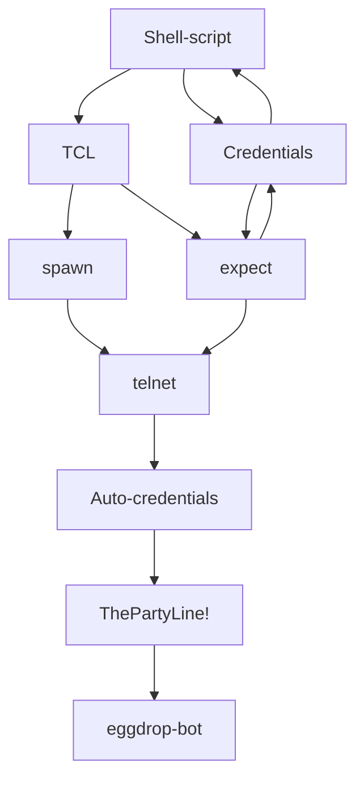

# 
Send Credentials Auto-Magically

### 
telnet bot.sh

$\color{red}\textsf{\Large&#x24D8;\normalsize}$ See: `Extended description` A.K.A: `Commit message` — You can view this simply by pressing the three dots ... 
(Ellipsis) button on the upper left-hand side above.

Generally on GitHub the 'Commit message' acts as a sort of 'header' for the commit, and underneath that 'header'; which GitHub makes bold, lies more of the 'Commit message', referred to on GitHub as an 'Extended description', which is also known as the 'body' of the commit, albeit this is still essentially just a part of the Commit message; but MORE of it, though separated underneath by a new line.  The combination of these two components, with the terms: "header" and "body," collectively forms up to a whole entity that you'd commonly refer to as the: "Commit message".

> $\color{#58A6FF}\textsf{\Large\&#x24D8;\kern{0.2cm}\normalsize ‎ Note:}$ The Shell script doesn't press Enter on that last .quit command either, & if you wanted to just .rehash; it's done automatically for you — the .quit part is only sent to the text line; but without actually being sent out... I.E not triggering as a command — with it there, if you want to actually .quit — if your only intention was to just: rehash from The Party Line, then you can just press Enter yourself and submit the unsent line to quit — though, If you wanna stay, just backspace the .quit and issue out whatever other commands you need to The Party Line!

> $\color{#D29922}\textsf{\Large\&#x26A0;\kern{0.2cm}\normalsize ‎ Warning:}$ \
Tags — Shell-script-Credentials-Auto-credentials-send-spawn-telnet-eggdrop-bot-TCL-expect-ThePartyLine!

